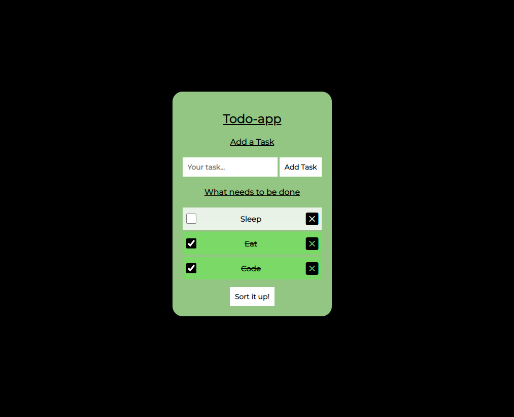

# Todo-App

### Description

A Todo app made with TypeScript, where you can add tasks, mark them as done and remove them. The todolist is stored using localStorage so its saved even tho you turn off your browser(as long as you dont clear it).

### How it looks



### Technologies


### Project setup

Run the following commands.

```ps1
npm install
```

To get all the dependencies needed.

### Run project

```ps1
npm run dev
```

#### Build and preview Project

```ps1
npm run build
```
```ps1
npm run preview
```

### Conventional Commits

- feat --> adding a new function or feature
- fix --> when fixing a bug
- refactor --> when refactoring functions and variables
- build --> when new package is installed
- docs --> when README is updated

Example:

```ps1
git commit -m "(refactor): more conventional namning on function"
```
